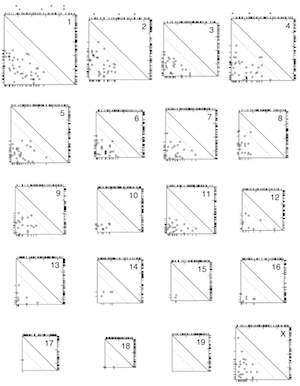

  

      <ul class="nav">
          <li><a href="{{ BASE_PATH }}/assets/karthikeyanveera_cv.pdf">cv</a></li>
          <li><a href="https://github.com/kvvchetty">github</a></li>
          <li><a href="https://kvvconsultant.blogspot.com">blog</a></li>
          <li><a href="https://twitter.com/kvvchetty">@kvvchetty</a></li>
      </ul>
  

<table class="wide">
<tr>
  <td class="left">
    
  </td>
  <td class="right">
    
  </td>
</tr>

</table>

  

      <ul class="nav">
          <li><a href="morefigs.html">more...</a></li>
      </ul>
  

